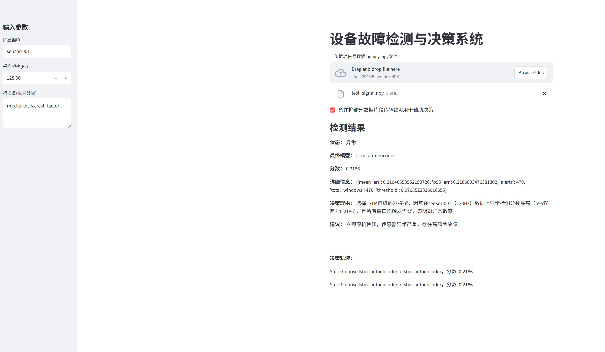

# Equipment-Fault-Detection

## 项目简介
本项目为「设备故障预警系统」协作仓库，聚焦于基于传感器数据的轴承故障检测、预警与定位算法的开发与优化。目标是提升轴承在实际工况下的故障预警的准确率、降低误报率，并推动算法的工程化落地与持续迭代。

本系统集成了多模型融合与大语言模型（LLM）智能路由决策机制，支持通过 LLM 动态选择最优检测模型，实现更智能的决策支持。前端采用 Streamlit 框架，提供简洁美观的交互界面，支持数据上传、检测结果展示及与 LLM 的交互式决策说明。

## 项目结构
```
Equipment-Fault-Detection/
├── README.md
├── main.py
├── frontend.py
├── gen_npy_from_mat.py
├── test_signal.npy
├── artifacts_cwru_lstm_ae/
│   ├── lstm_ae_model.h5
│   ├── lstm_ae_scaler.pkl
│   └── lstm_ae_meta.json
├── data_processing/
│   ├── decision_agent.py
│   ├── cwru_lstm_autoencoder.py
│   └── mqtt_fault_sender.py
└── 凯斯西储大学数据/
    ├── 12k Drive End Bearing Fault Data/
    ├── 12k Fan End Bearing Fault Data/
    ├── 48k Drive End Bearing Fault Data/
    └── Normal Baseline Data/
```

## 主要文件/文件夹说明

| 路径/文件名                        | 说明                                                         |
|-------------------------------------|--------------------------------------------------------------|
| README.md                           | 项目说明文档                                                 |
| main.py                             | 主程序入口，支持前端和命令行两种模式                         |
| frontend.py                         | Streamlit 前端界面，交互式上传数据并展示检测结果              |
| gen_npy_from_mat.py                 | mat文件转npy测试数据脚本                                     |
| test_signal.npy                     | 示例振动信号npy文件（可用于前端上传测试）                    |
| artifacts_cwru_lstm_ae/             | 存放训练好的LSTM自编码器模型及其scaler、meta信息             |
| ├── lstm_ae_model.h5                | LSTM自编码器模型权重文件                                     |
| ├── lstm_ae_scaler.pkl              | 归一化/标准化scaler文件                                      |
| └── lstm_ae_meta.json               | 模型窗口、步长、阈值等元信息                                 |
| data_processing/                    | 数据处理与推理相关代码                                       |
| ├── decision_agent.py               | 决策与推理核心，集成多种模型和 LLM 选择逻辑                  |
| ├── cwru_lstm_autoencoder.py        | LSTM自编码器模型训练脚本（仅训练时用）                        |
| └── mqtt_fault_sender.py            | 故障结果MQTT发送脚本（如有用到）                             |
| 凯斯西储大学数据/                    | CWRU原始振动数据集，含多种工况和部件                         |
| ├── 12k Drive End Bearing Fault Data/| 12k转速驱动端轴承故障数据                                   |
| ├── 12k Fan End Bearing Fault Data/  | 12k转速风扇端轴承故障数据                                   |
| ├── 48k Drive End Bearing Fault Data/| 48k转速驱动端轴承故障数据                                   |
| └── Normal Baseline Data/            | 正常工况数据                                                |

## 示例输出页面
