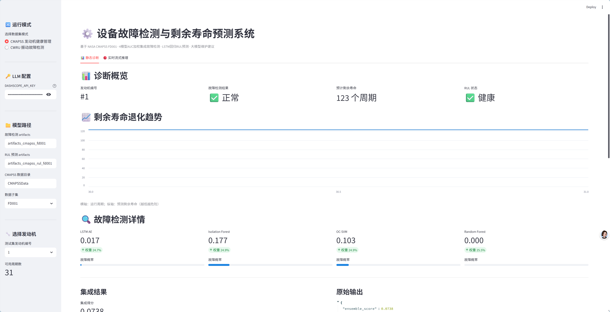
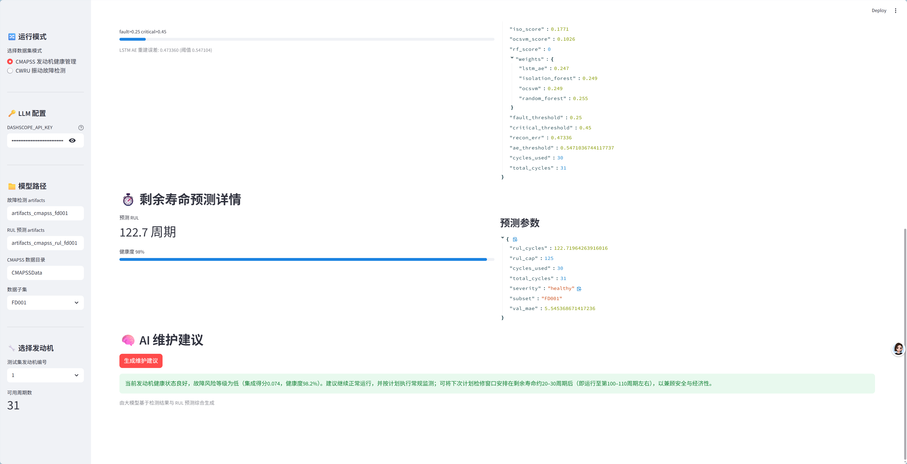
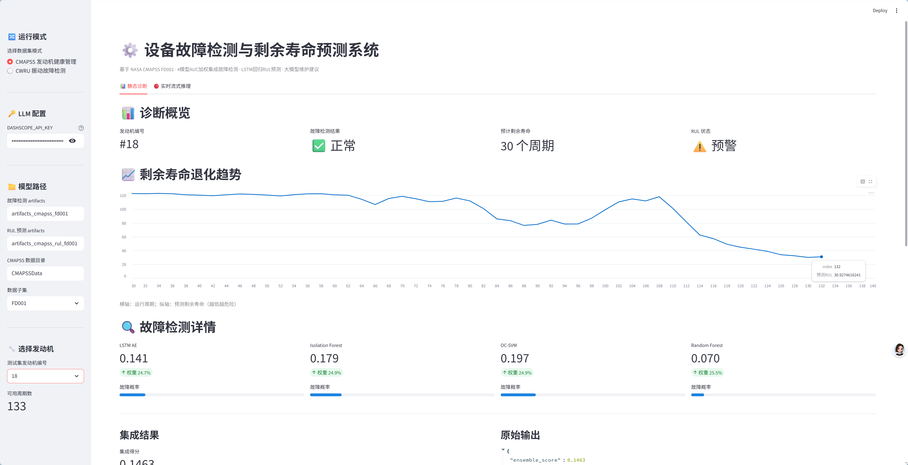
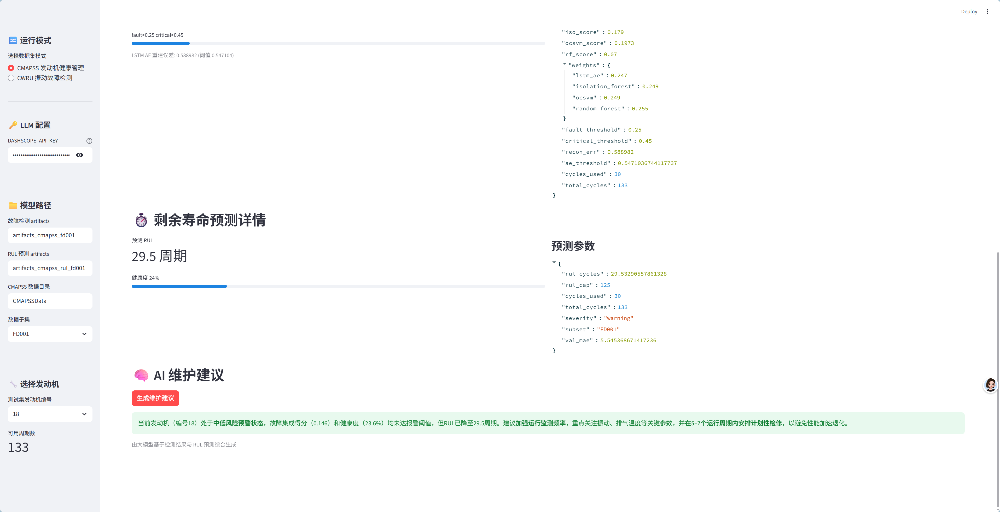

# 设备故障检测与剩余寿命预测系统

基于 NASA CMAPSS FD001 · 4模型AUC加权集成故障检测 · LSTM回归RUL预测 · 大模型维护建议

---

## 系统简介

本系统面向工业设备预测性维护需求，构建了一套"多模型并行检测 + AUC加权融合决策 + 大语言模型解释"的三层智能诊断系统。

**核心能力：**
- **故障检测**：4类模型并行推理（LSTM自编码器、孤立森林、One-Class SVM、随机森林），以AUC加权集成输出综合故障概率
- **剩余寿命预测（RUL）**：LSTM回归模型预测设备距故障的剩余可用周期数
- **AI维护建议**：大语言模型（通义千问）结合检测结果与RUL预测，生成专业可执行的维护意见
- **实时流式推理**：逐周期滑动窗口引擎，模拟在线检测场景

---

## 界面截图

### 健康发动机诊断（Engine #1，RUL=123周期）


### RUL详情与AI维护建议（Engine #1）


### 退化中发动机诊断（Engine #18，RUL=30周期，预警状态）


### 预警状态AI维护建议（Engine #18）


---

## 项目结构

```
Equipment-Fault-Detection/
├── main.py                             # 主入口（启动前端）
├── gen_npy_from_mat.py                 # mat 转 npy 工具脚本
├── test_signal.npy                     # CWRU 演示振动信号
│
├── frontend/
│   └── app.py                          # Streamlit 双模式前端（CMAPSS / CWRU）
│
├── models/                             # 模型 Runner 层
│   ├── base.py                         # ModelRunner / ModelResult / ModelConfig 接口
│   ├── cmapss_lstm_ae_runner.py        # CMAPSS 4模型集成检测 Runner
│   ├── cmapss_rul_runner.py            # CMAPSS RUL 预测 Runner
│   ├── cwru_ensemble_runner.py         # CWRU 振动故障检测 Runner（历史保留）
│   └── registry.py                     # 模型注册表
│
├── training/                           # 离线训练脚本
│   ├── cmapss_fault_detection.py       # CMAPSS 4模型集成训练
│   ├── cmapss_rul.py                   # CMAPSS RUL 回归训练
│   └── cwru_ensemble.py                # CWRU 集成训练（历史保留）
│
├── agent/                              # 大模型决策层
│   ├── llm.py                          # LLM 接口（DummyLLM / BailianLLM）
│   ├── prompts.py                      # Prompt 模板（CMAPSS 专用）
│   └── fusion_agent.py                 # CWRU LLM 会诊融合 Agent（历史保留）
│
├── stream/
│   └── engine.py                       # 滑动窗口流式推理引擎
│
├── evaluation/
│   └── cmapss_eval.py                  # CMAPSS 综合评估脚本
│
├── utils/
│   ├── cmapss_loader.py                # CMAPSS 数据加载与滑窗构造
│   └── data_loader.py                  # CWRU 数据加载
│
├── feature_engineering/                # 振动信号特征提取（CWRU 使用）
│   ├── time_domain.py                  # 时域特征（RMS / 峰度 / 波峰因子等）
│   ├── frequency_domain.py             # 频域特征（谱质心 / 谱熵等）
│   └── pipeline.py                     # 统一特征提取管线
│
├── transport/
│   └── mqtt_subscriber.py              # MQTT 数据接入（下位机实时数据）
│
├── artifacts_cmapss_fd001/             # 故障检测模型产物
│   ├── lstm_ae_model.keras
│   ├── lstm_ae_scaler.pkl
│   ├── lstm_ae_meta.json
│   ├── isolation_forest.pkl
│   ├── ocsvm.pkl
│   ├── random_forest_clf.pkl
│   └── ensemble_meta.json              # AUC权重 + 归一化边界 + 阈值配置
│
├── artifacts_cmapss_rul_fd001/         # RUL 预测模型产物
│   ├── rul_lstm_model.keras
│   ├── rul_scaler.pkl
│   └── rul_meta.json
│
├── CMAPSSData/                         # NASA CMAPSS 数据集
│   ├── train_FD001.txt
│   ├── test_FD001.txt
│   └── RUL_FD001.txt
│
└── 凯斯西储大学数据/                   # CWRU 轴承振动数据集（验证阶段使用）
    ├── 12k Drive End Bearing Fault Data/
    ├── 12k Fan End Bearing Fault Data/
    ├── 48k Drive End Bearing Fault Data/
    └── Normal Baseline Data/
```

---

## 快速开始

### 环境要求

```bash
pip install -r requirements.txt
```

主要依赖：`tensorflow>=2.13`、`scikit-learn>=1.3`、`streamlit>=1.35`、`numpy`、`pandas`、`joblib`

### 训练模型（需 CMAPSS 数据）

```bash
# 第一步：故障检测（4模型集成）
python -m training.cmapss_fault_detection train \
    --data_dir CMAPSSData --subset FD001 \
    --out_dir artifacts_cmapss_fd001 --epochs 20

# 第二步：RUL 预测
python -m training.cmapss_rul train \
    --data_dir CMAPSSData --subset FD001 \
    --out_dir artifacts_cmapss_rul_fd001 --epochs 50
```

### 启动前端

```bash
python main.py
# 选择 1 启动前端，浏览器访问 http://localhost:8501
```

或直接：

```bash
streamlit run frontend/app.py
```

### 评估模型性能

```bash
python -m evaluation.cmapss_eval \
    --data_dir CMAPSSData \
    --fd_dir artifacts_cmapss_fd001 \
    --rul_dir artifacts_cmapss_rul_fd001
```

---

## 模型性能

### 故障检测（CMAPSS FD001，测试集 100 台发动机，故障率 25%）

| 模型 | 准确率 | 精确率 | 召回率 | F1 |
|---|---|---|---|---|
| LSTM 自编码器 | 94.0% | 88.0% | 88.0% | 88.0% |
| 孤立森林 | 88.0% | 72.4% | 84.0% | 77.8% |
| One-Class SVM | 89.0% | 70.6% | 96.0% | 81.4% |
| 随机森林 | 91.0% | 94.4% | 68.0% | 79.1% |
| **AUC 加权集成** | **94.0%** | **91.3%** | **84.0%** | **87.5%** |

### RUL 预测（CMAPSS FD001）

| 指标 | 数值 |
|---|---|
| 测试集 MAE | 13.15 周期 |
| 测试集 RMSE | 17.23 周期 |
| NASA Score | 618.2（越低越好） |

---

## 系统架构

```
传感器数据 / MQTT 下位机
        ↓
    数据预处理（滑窗 30×14）
        ↓
┌─────────────────────────────┐
│      4 模型并行推理          │
│  LSTM AE │ IF │ OC-SVM │ RF │
└─────────────────────────────┘
        ↓
   AUC 加权集成（ensemble_meta.json）
        ↓
   综合故障得分 + RUL 预测
        ↓
   通义千问 API → 维护建议
        ↓
   Streamlit 可视化前端
```

---

## LLM 配置

在前端侧边栏填入阿里百炼 API Key（`DASHSCOPE_API_KEY`），或设置环境变量：

```bash
export DASHSCOPE_API_KEY=your_key_here
```

留空时系统使用规则生成兜底建议，不影响故障检测与 RUL 预测功能。

---

## 注意事项

- 模型在 **FD001**（单工况）上训练，测试时请选择 FD001 子集以获得正确结果
- 选择其他子集（FD002/FD003/FD004）会因训练分布不匹配导致无监督模型误报
- MQTT 接入配置见 `transport/mqtt_subscriber.py`