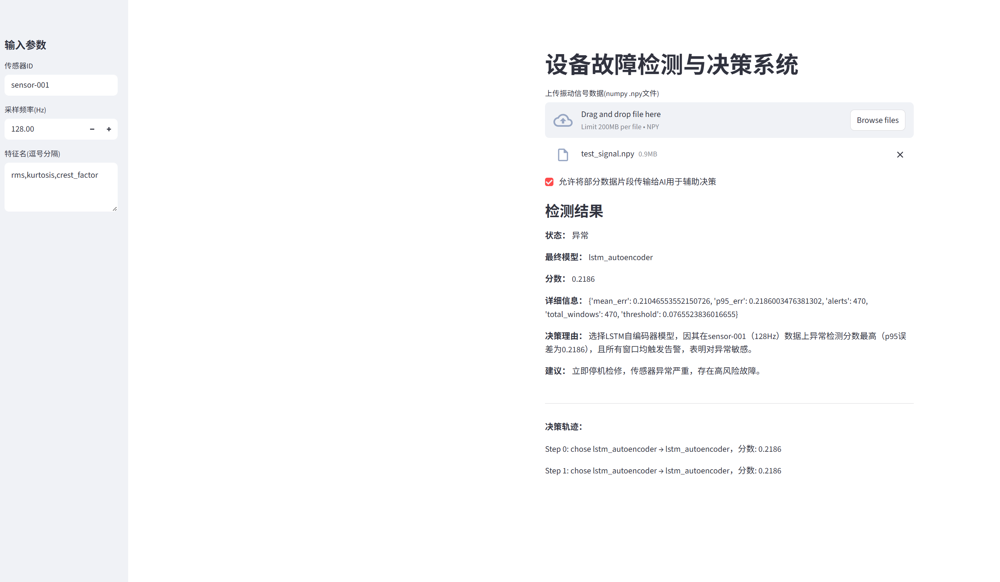

# Equipment-Fault-Detection

## 项目简介
本项目为「设备故障预警系统」协作仓库，聚焦于基于传感器数据的轴承故障检测、预警与定位算法的开发与优化。目标是提升轴承在实际工况下的故障预警的准确率、降低误报率，并推动算法的工程化落地与持续迭代。

本系统集成了多模型融合与大语言模型（LLM）智能路由决策机制，支持通过 LLM 动态选择最优检测模型，实现更智能的决策支持。前端采用 Streamlit 框架，提供简洁美观的交互界面，支持数据上传、检测结果展示及与 LLM 的交互式决策说明。

## 项目结构
```
Equipment-Fault-Detection/
├── README.md
├── main.py                          # 主入口（前端/命令行）
├── gen_npy_from_mat.py              # mat 转 npy 脚本
├── test_signal.npy                  # 示例振动信号
│
├── frontend/                        # 前端界面
│   └── app.py                       # Streamlit 前端
│
├── models/                          # 核心算法模型
│   ├── base.py                      # ModelRunner / ModelResult / ModelConfig 接口
│   ├── lstm_autoencoder.py          # LSTM 自编码器推理
│   ├── arima_runner.py              # ARIMA 残差检测
│   ├── placeholder_runners.py       # RF / ANN / PCA 等占位 runner
│   └── registry.py                  # 模型注册表与工厂
│
├── agent/                           # AI Agent 决策引擎
│   ├── llm.py                       # LLM 接口（DummyLLM / BailianLLM）
│   ├── react_agent.py               # ReAct 风格编排器
│   ├── prompts.py                   # Prompt 模板
│   └── tools.py                     # 状态汇总、解释、建议、Agent 装配
│
├── feature_engineering/             # 特征工程
│   ├── time_domain.py               # 时域特征（RMS / 峰度 / 波峰因子…）
│   ├── frequency_domain.py          # 频域特征（FFT / 谱质心 / 谱熵…）
│   └── pipeline.py                  # 统一特征提取管线
│
├── utils/                           # 公共工具
│   ├── data_loader.py               # CWRU 数据加载、滑动窗口
│   └── evaluation.py                # 分类 / 异常检测评估指标
│
├── training/                        # 模型训练管线
│   └── cwru_lstm_autoencoder.py     # LSTM-AE 训练脚本
│
├── data_processing/                 # [旧] 向后兼容层
│   └── decision_agent.py            # 重导出所有符号，兼容旧 import
│
├── artifacts_cwru_lstm_ae/          # 模型产物
│   ├── lstm_ae_model.h5
│   ├── lstm_ae_scaler.pkl
│   └── lstm_ae_meta.json
│
└── 凯斯西储大学数据/                # CWRU 原始振动数据集
    ├── 12k Drive End Bearing Fault Data/
    ├── 12k Fan End Bearing Fault Data/
    ├── 48k Drive End Bearing Fault Data/
    └── Normal Baseline Data/
```

## 主要文件/文件夹说明

| 路径/文件名                        | 说明                                                         |
|-------------------------------------|--------------------------------------------------------------|
| README.md                           | 项目说明文档                                                 |
| main.py                             | 主程序入口，支持前端和命令行两种模式                         |
| **frontend/**                       | **前端界面包**                                               |
| └── app.py                          | Streamlit 前端界面，交互式上传数据并展示检测结果              |
| **models/**                         | **核心算法模型包**                                           |
| ├── base.py                         | ModelRunner / ModelResult / ModelConfig 基础接口              |
| ├── lstm_autoencoder.py             | LSTM 自编码器推理 runner                                     |
| ├── arima_runner.py                 | ARIMA 残差检测 runner                                        |
| ├── placeholder_runners.py          | RF / ANN / KMeans / IF / SVM 等占位 runner                   |
| └── registry.py                     | 模型注册表与工厂函数                                         |
| **agent/**                          | **AI Agent 决策引擎包**                                      |
| ├── llm.py                          | LLM 接口（DummyLLM / BailianLLM）                           |
| ├── react_agent.py                  | ReAct 风格 Agent 编排器                                      |
| ├── prompts.py                      | Prompt 模板（路由、解释、建议）                              |
| └── tools.py                        | 状态汇总、解释、建议生成、Agent 装配                         |
| **feature_engineering/**            | **特征工程包**                                               |
| ├── time_domain.py                  | 时域特征（RMS / 峰度 / 波峰因子 / 脉冲因子等）              |
| ├── frequency_domain.py             | 频域特征（谱质心 / 谱峰 / 谱熵等）                          |
| └── pipeline.py                     | 统一特征提取管线                                             |
| **utils/**                          | **公共工具包**                                               |
| ├── data_loader.py                  | CWRU 数据加载、滑动窗口、信号采集                            |
| └── evaluation.py                   | 异常检测 / 分类评估指标                                      |
| **training/**                       | **模型训练管线**                                             |
| └── cwru_lstm_autoencoder.py        | LSTM 自编码器训练脚本（仅训练时用）                          |
| data_processing/                    | [旧] 向后兼容层，重导出所有符号                              |
| gen_npy_from_mat.py                 | mat文件转npy测试数据脚本                                     |
| test_signal.npy                     | 示例振动信号npy文件（可用于前端上传测试）                    |
| artifacts_cwru_lstm_ae/             | 存放训练好的LSTM自编码器模型及其scaler、meta信息             |
| 凯斯西储大学数据/                    | CWRU原始振动数据集，含多种工况和部件                         |

## 示例输出页面
